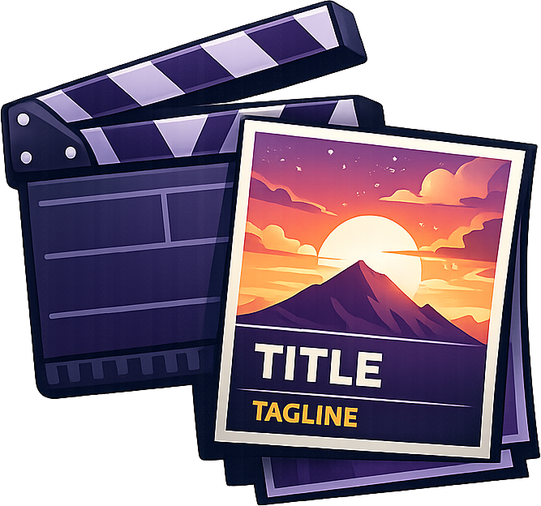

<div align="center">



# Better Posters

[](https://code.neureka.dev/jellyfin/better-posters/releases)
[](https://code.neureka.dev/jellyfin/better-posters/actions)
[](./LICENSE.md)
[](https://code.neureka.dev/jellyfin/better-posters)
[](https://code.neureka.dev/jellyfin/better-posters)

**Better Posters** is an unofficial Jellyfin plugin that lets you replace standard movie and show posters with customizable posters from [btttr.cc](https://btttr.cc).

</div>

> [!IMPORTANT]  
> This repository's GitHub mirror is for reference only. Please submit bug reports and feature requests to our [official Forgejo repository](https://code.neureka.dev/jellyfin/better-posters).

**Minimum Jellyfin version:** 10.11.10

## Features

- **Movies and Shows:** Registers as a remote primary image provider for movie and series items.
- **Configurable Poster Overlays:** Toggle trend tags, quality badges, genre, rating, and age rating.
- **Rating Source Selection:** Use btttr.cc average ratings or choose IMDb, TMDB, Rotten Tomatoes, Metacritic, Trakt, Letterboxd, or Roger Ebert.
- **Multi-Language Posters:** Select English, Spanish, French, German, Portuguese, Italian, Dutch, Polish, Russian, Turkish, Arabic, Japanese, Korean, Chinese, Hindi, Swedish, or Czech.
- **Scheduled Replacement:** Optionally replace existing movie and show posters through Jellyfin Scheduled Tasks.

## Installation Guide

### Option 1: Install from the Plugin Repository

1. Open **Dashboard -> Plugins -> Repositories** in Jellyfin.
2. Add this repository URL:

    ```text
    https://code.neureka.dev/jellyfin/better-posters/raw/branch/master/manifest.json
    ```

3. Open **Dashboard -> Plugins -> Catalog**.
4. Select **Better Posters** and install the latest compatible version.
5. Restart Jellyfin.
6. Confirm **Better Posters** appears under **Dashboard -> Plugins -> My Plugins**.

### Option 2: Install Manually from a Release

1. Download the latest `better-posters_*.zip` asset from the [Forgejo releases page](https://code.neureka.dev/jellyfin/better-posters/releases).
2. Stop Jellyfin.
3. Create a Better Posters plugin folder under your Jellyfin plugins directory.
4. Extract the release zip into that folder.
5. Start Jellyfin.
6. Confirm **Better Posters** appears under **Dashboard -> Plugins -> My Plugins**.

### Option 3: Build from Source

1. Install the .NET SDK that can build `net9.0` projects.
2. From this repository, run:

    ```shell
    dotnet publish BetterPosters/BetterPosters.csproj -c Release
    ```

3. Locate the published `BetterPosters.dll`.
4. Stop Jellyfin.
5. Create a Better Posters plugin folder under your Jellyfin plugins directory.
6. Copy `BetterPosters.dll` into that folder.
7. Start Jellyfin.
8. Confirm **Better Posters** appears under **Dashboard -> Plugins -> My Plugins**.

This plugin is built for Jellyfin 10.11.10 and may not load on older Jellyfin versions.

## Configuration & Setup

Open **Dashboard -> Plugins -> My Plugins -> Better Posters**.

Default settings:

- **Trend Tags:** Enabled
- **Quality Tags:** Disabled
- **Genre:** Enabled
- **Ratings:** Enabled
- **Ratings Source:** Average
- **Age Rating:** Disabled
- **Language:** English

The **Update Better Posters** scheduled task is unscheduled by default. Configure it under **Dashboard -> Scheduled Tasks** to replace existing primary posters for Movies and Shows that have an IMDb ID.

## How to Apply Posters to Your Library

### Option A: Apply to a Single Movie or Show

1. Open a Movie or Show in Jellyfin.
2. Select **Edit Images**.
3. Search remote images.
4. Choose the Better Posters primary image.

### Option B: Apply During Metadata Refresh

1. Go to **Dashboard -> Libraries**.
2. Open the menu for a Movies or Shows library.
3. Select **Scan Library**.
4. Choose metadata refresh options that replace existing images.

### Option C: Apply Automatically

1. Open **Dashboard -> Scheduled Tasks**.
2. Select **Update Better Posters**.
3. Add the schedule you want Jellyfin to use.
4. The scheduled task will replace matching movie and show primary images using the current poster settings.

## Troubleshooting

- **No Better Posters image appears:** Confirm the item has an IMDb ID. This plugin intentionally uses IMDb IDs for btttr.cc URLs.
- **Plugin does not load:** Confirm the server is Jellyfin 10.11.10 or newer in the 10.11 line and restart Jellyfin after copying the plugin DLL.
- **Poster did not change after selecting one:** Clear the browser cache or check another Jellyfin client. Jellyfin and browsers can cache images aggressively.

## Disclaimer

This is an unofficial Jellyfin plugin. Poster artwork and generated image output are provided by [btttr.cc](https://btttr.cc).
